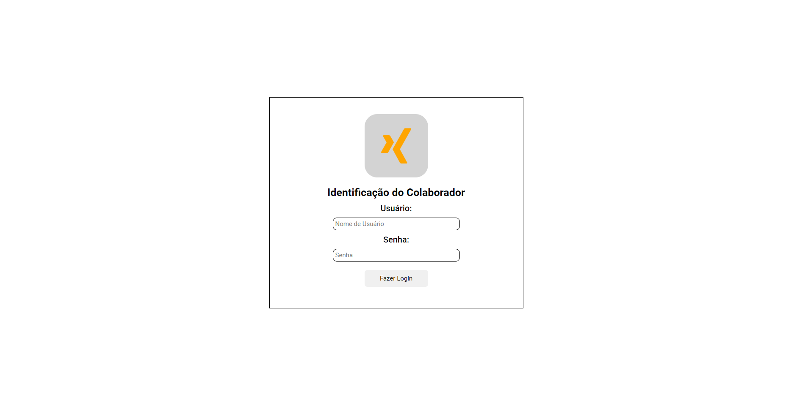
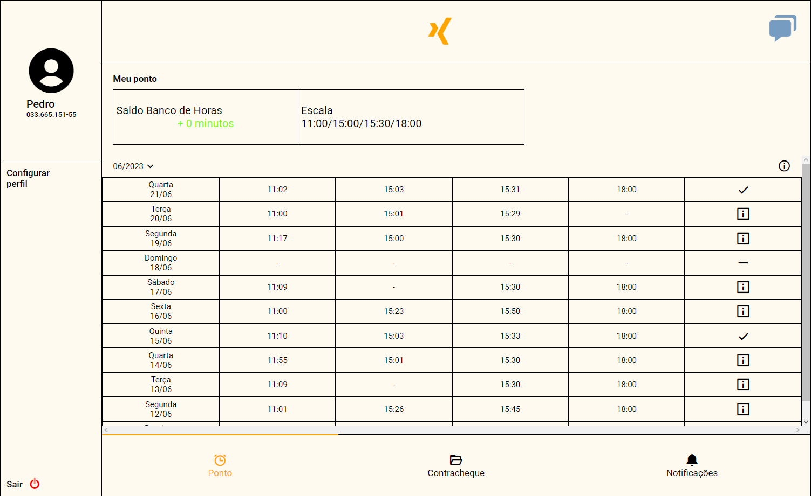
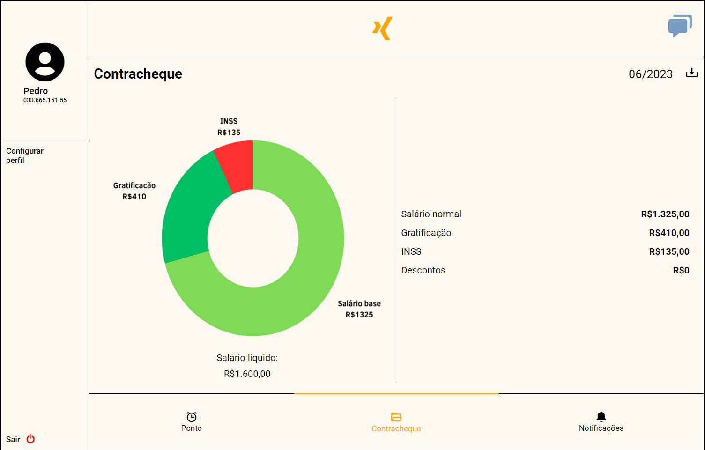
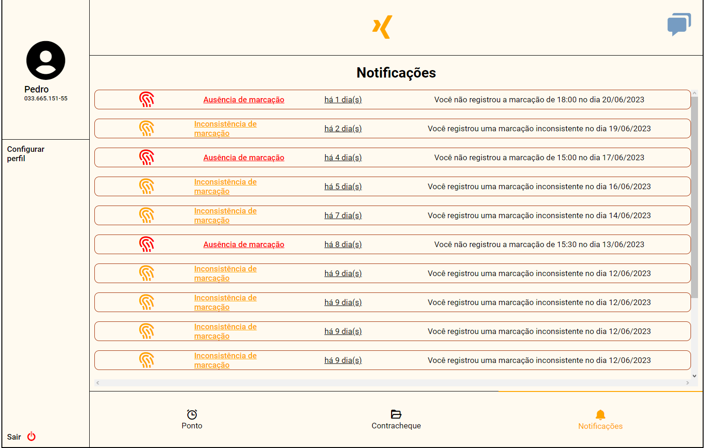
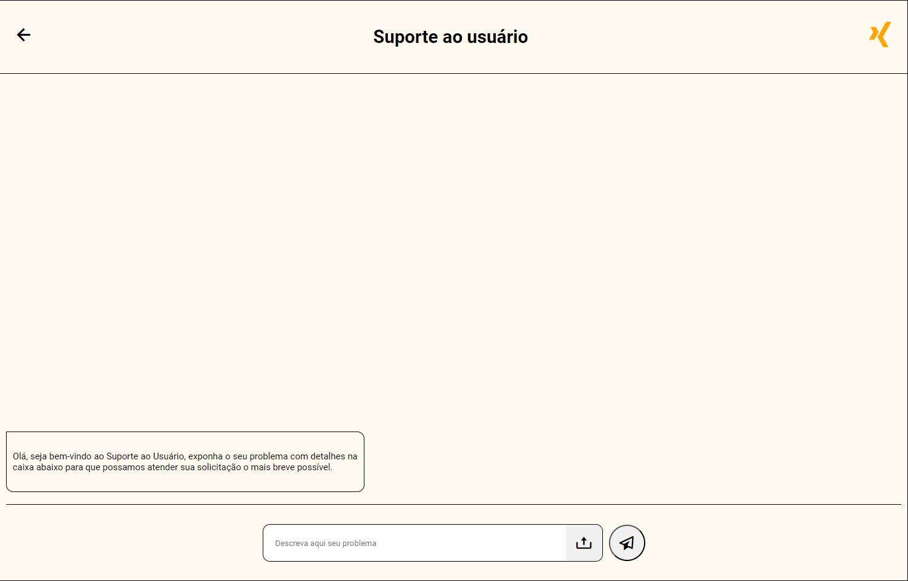
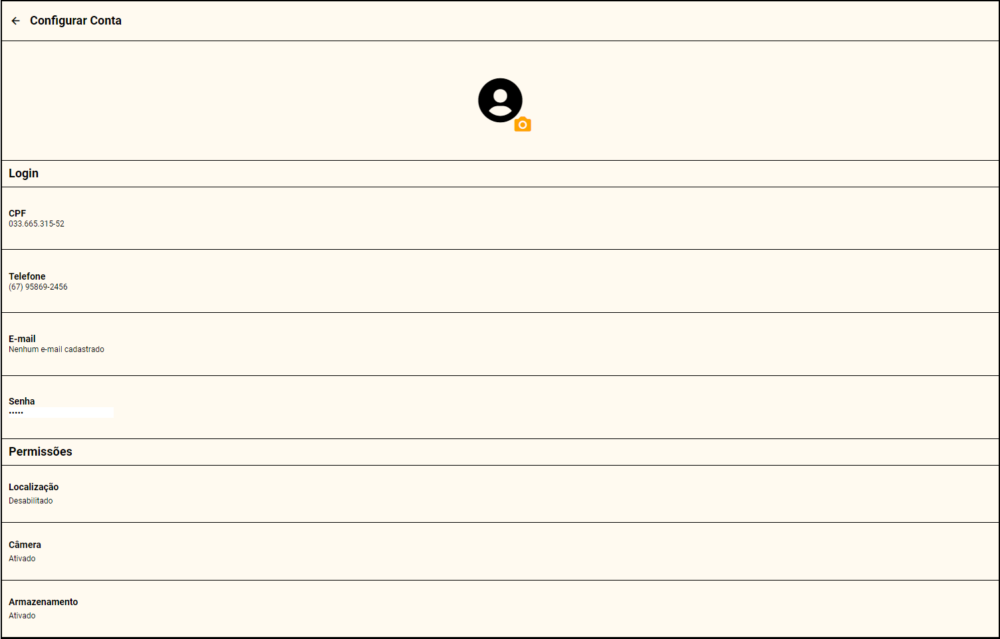

# Trabalho TADS

Este projeto consiste em um conjunto de 6 telas desenvolvido como parte da avaliação do segundo semestre do curso de Analise e Desenvolvimento de Sistemas no IFMS Campi Três Lagoas.

## Objetivo

Este conjunto de telas tem como principal objetivo aplicar de forma prática os conhecimentos adquiridos durante o segundo semestre do curso de Analise e Desenvolvimento de Sistemas. Ele representa uma oportunidade de consolidar e demonstrar as habilidades desenvolvidas ao longo das aulas teóricas, colocando em prática os conceitos aprendidos.

Construído como parte da avaliação prática, o projeto busca não apenas avaliar o domínio de HTML e CSS, mas também a capacidade de integrar e aplicar essas tecnologias para criar soluções funcionais e visualmente atraentes. Este dashboard serve como um meio de evidenciar a compreensão e aplicação efetiva dos tópicos abordados durante o curso.

## Telas

### Tela de Login

### Tela Inicial

### Tela de Contracheque

### Tela de Notificação

### Tela de Chat

### Tela de Configurações

