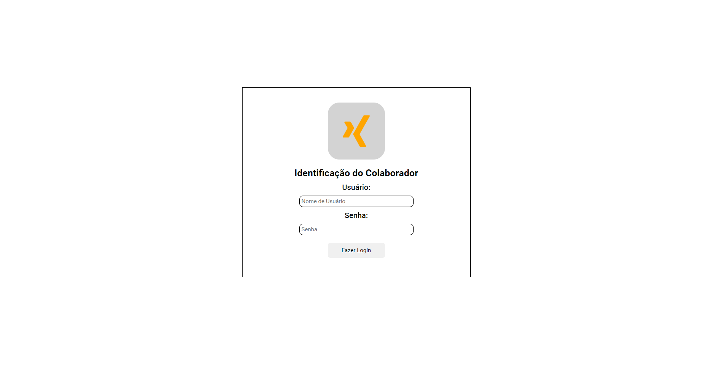
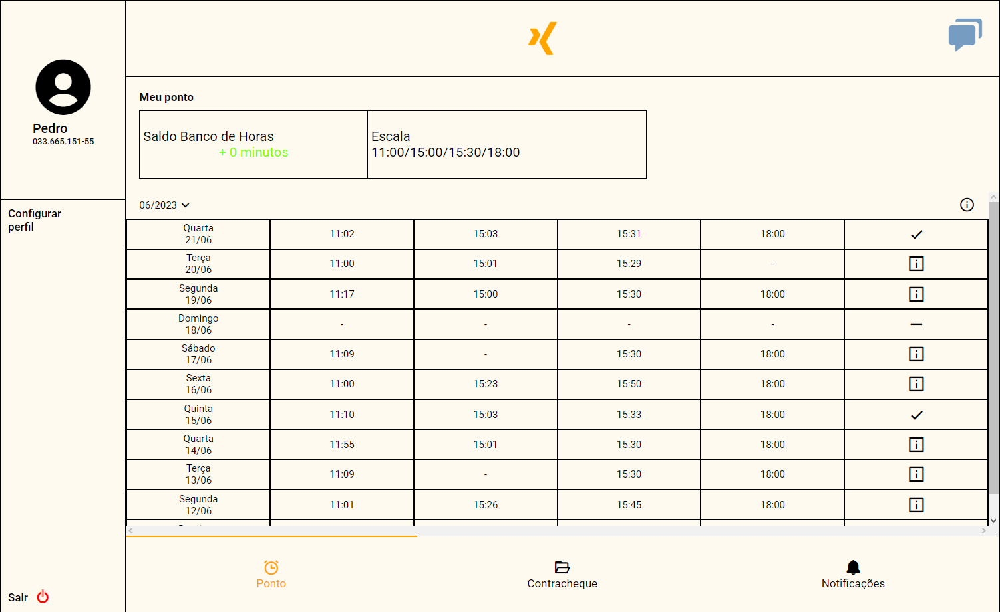
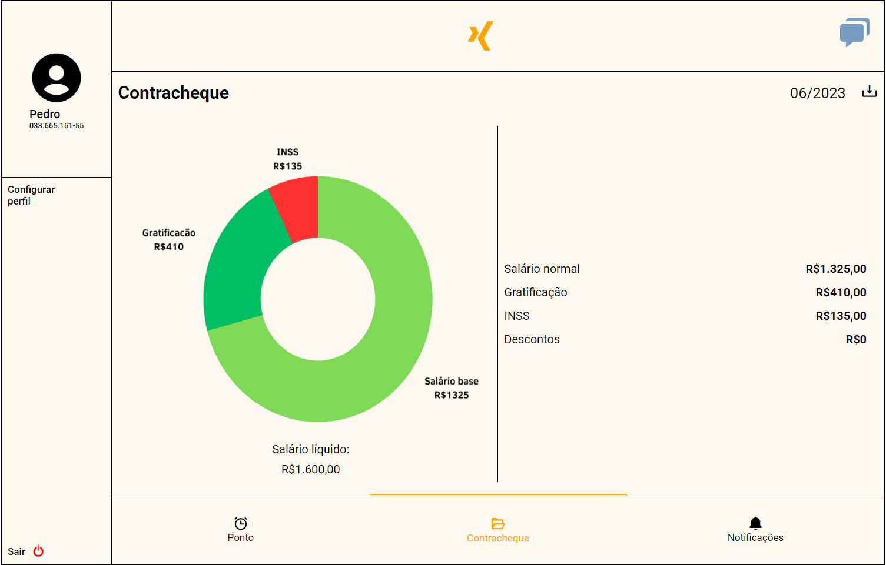
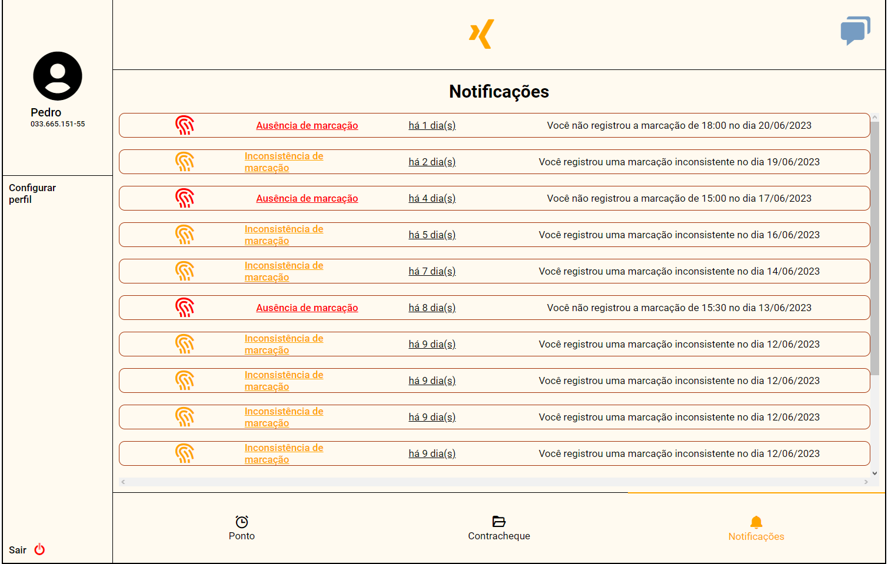
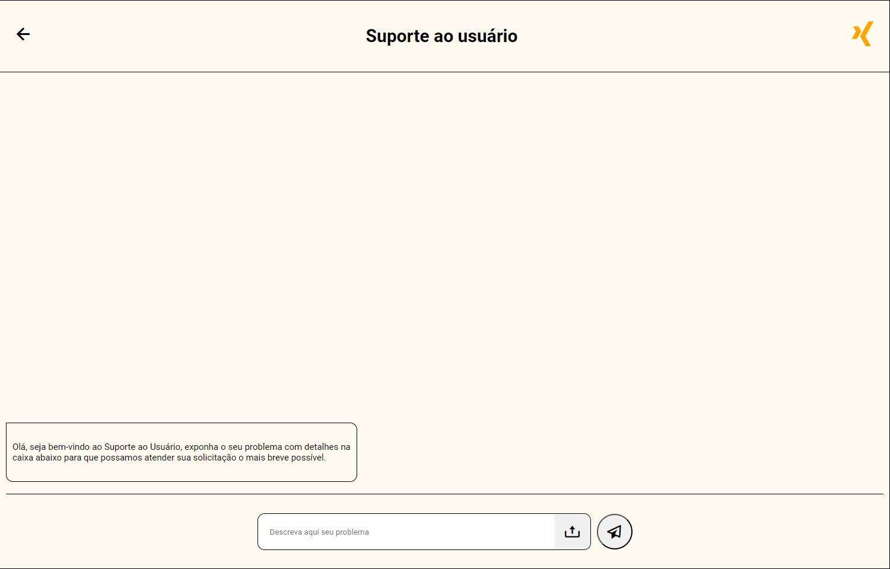
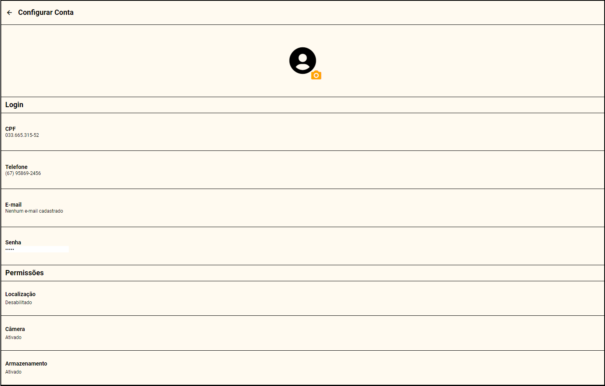

# Trabalho TADS

Este projeto é uma reprodução de um sistema de ponto mobile.

É uma implementação de um sistema de ponto e contracheque desenvolvido como parte da avaliação do segundo semestre do curso de Analise e Desenvolvimento de Sistemas no IFMS Campi Três Lagoas.

## Objetivo

O principal propósito deste projeto é aplicar de maneira prática os conhecimentos adquiridos durante o segundo semestre do curso de TADS. Ele representa uma oportunidade valiosa para consolidar e demonstrar as habilidades desenvolvidas, transformando os conceitos teóricos em uma aplicação tangível.

Desenvolvido como parte da avaliação prática, o projeto vai além da simples avaliação do domínio de HTML e CSS. Ele busca verificar a capacidade de integrar essas tecnologias para criar soluções funcionais e visualmente atrativas. Este conjunto de telas serve como um meio para evidenciar a compreensão e aplicação efetiva dos tópicos abordados durante o curso.

## Telas

|                                                                               |                                                                               |                                                                               |
| ----------------------------------------------------------------------------- | ----------------------------------------------------------------------------- | ----------------------------------------------------------------------------- |
| Tela de Login                                                                 | Tela Inicial                                                                  | Tela de Contracheque                                                          |
| [](./docs/image.png)     | [](./docs/image-1.png) | [](./docs/image-2.png) |
| Tela de Contracheque                                                          | Tela de Notificação                                                           | Tela de Chat                                                                  |
| [](./docs/image-3.png) | [](./docs/image-4.png) | [](./docs/image-5.png) |

## Estrutura do Projeto

```
/
|-- css/
|   |-- scss/
|   |    |-- medias/
|   |    |   |-- _cell.scss
|   |    |   |-- _tablet.scss
|   |    |-- pages/
|   |    |   |-- _login.scss
|   |    |   |-- _contracheque.scss
|   |    |   |-- _notificacoes.scss
|   |    |   |-- _chat.scss
|   |    |   |-- _configuracoes.scss
|   |    |   |-- _home.scss
|   |    |-- _functions.scss
|   |-- style.css
|   |-- style.scss
|   |-- style.css.map
|-- html/
|   |-- index.html
|   |-- home.html
|   |-- notificacoes.html
|   |-- chat.html
|   |-- configuracoes.html
|   |-- contracheque.html
|-- img/
|   |-- sem-fundo.png
|-- docs/
|   |-- image.png
|   |-- image-1.png
|   |-- image-2.png
|   |-- image-3.png
|   |-- image-4.png
|   |-- image-5.png
|-- README.MD
```

## Contato

Em caso de dúvidas ou sugestões, sinta-se à vontade para entrar em contato pelo e-mail raifernandes076@gmail.com ou via Instagram: @rai.fernandes\_.
